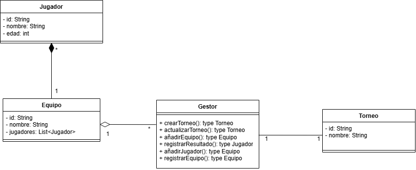

# torneo-esports-uml
Actividad 3 de Entornos de desarrollo

# Sistema de Gestión de Torneos de eSports
## Autor: Zaira González Encabo

Perfil de GitHub: ZairaGe
## Descripción del Proyecto:
Este proyecto implementa un sistema de gestión de torneos de eSports
utilizando UML para el modelado y Java para la implementación.

Link al repositorio del proyecto: https://github.com/ZairaGe/torneo-esports-uml

## Diagrama UML: 
En el diagrama se puede ver los Actores GESTOR y JUGADOR.

EXTENDS: no es indispensable que ocurra

### Diagrama de Casos de Uso:
En el diagrama se pueden ver las entidades: JUGADOR, EQUIPO, TORNEO y GESTOR, que es el que tiene los métodos
y une TORNEO con EQUIPO.

### Diagrama de Clases

## Estructura del Proyecto
torneo-esports-uml/ ├── src/
│ ├── es/empresa/torneo/
│ │ ├── modelo/
│ │ ├── control/
│ │ ├── vista/
│ │ ├── Main.java
├── diagrams/
│ ├── casos-uso.png
│ ├── clases.png
├── README.md
├── .gitignore
├── LICENSE (opcional)
## Instalación y Ejecución
1. Clonar el repositorio:
`git clone https://github.com/usuario/torneo-esports-uml.git`
2. Compilar y ejecutar el proyecto:
`cd src javac es/empresa/torneo/Main.java java es.empresa.torneo.Main`
## Justificación del diseño
Por qué se eligió esa estructura y cómo se organizan las clases.

## Conclusiones
Sobre el aprendizaje obtenido.
Conclusión y sincera opinión de la actividad: a mi en lo personal me ha costado bastante entender la actividad, 
no creo que hayamos tenido las suficientes clases como para explicar la actividad y a mi se me ha hecho un poco
complicada y difícil de entender. Ni si quiera sé si está bien o si conseguí lo que pedía la actividad. 
Por otro lado, al no tener muy clara la actividad, el ejercicio que he hecho de investigación para poder sacarlo
adelante me ha ayudado en la medida de lo posible.
La parte de Java en unos puntos pone que NO es obligatorio, pero en otros puntos da a entender que sí... 
Como no he llegado a entender la actividad al 100%, hice los puntos que creo que sí son obligatorios por falta
de tiempo y falta de entendimiento.
